# ESP-IDF(Eclipse)の開発環境構築方法
Eclipseを使ったESP32の開発環境構築および、デバッグまでの手順を記載する。

- [ESP-IDF(Eclipse)の開発環境構築方法](#esp-idfeclipseの開発環境構築方法)
  - [1 環境構築](#1-環境構築)
    - [1.1 Eclipse](#11-eclipse)
    - [1.2 デバッガの構築](#12-デバッガの構築)
      - [1.2.1 デバッガの設定](#121-デバッガの設定)
      - [1.2.2 ESP32とデバッガの接続](#122-esp32とデバッガの接続)
  - [2 プロジェクトのビルド](#2-プロジェクトのビルド)
    - [2.1 プロジェクト作成](#21-プロジェクト作成)
    - [2.2 ビルド](#22-ビルド)
  - [3 ファームウェアの書き込みとデバッグ](#3-ファームウェアの書き込みとデバッグ)
  - [シリアルコンソールの接続](#シリアルコンソールの接続)
    - [ピン接続](#ピン接続)
    - [シリアルコンソールへの表示](#シリアルコンソールへの表示)

## 1 環境構築
### 1.1 Eclipse
|                           名称                           |  バージョン   |
| :------------------------------------------------------- | :------------ |
| [Eclipse(Full Edition C/C++)](https://mergedoc.osdn.jp/) | 20211219(x64) |
| [Python](https://www.python.org/downloads/)              | 3.10.1        |
| [ESP-IDF](https://github.com/espressif/esp-idf)          | 4.3.2         |

1. EclipseとPythonをダウンロードする。
1. Pythonをインストールする。
   `Add Python  3.10 to PATH`にチェックを入れる。
1. ESP32ディレクトリを移動しない場所に作成する。("C:\\"や"D:\\"など)
1. Eclipseを解凍して、eclipseディレクトリをESP32ディレクトに移動する。
1. Eclipseを起動する。
1. "ヘルプ" -> "新規ソフトウェアのインストール..."をクリックする。
   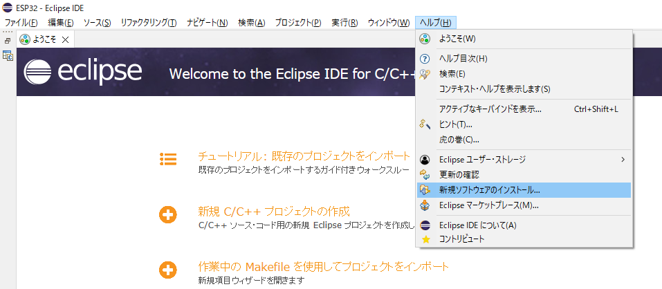
1. "追加"をクリックして、リポジトリーの追加ウィンドウを表示する。
1. 以下のように入力して、"OK"をクリックする。(名前は自由)
   * 名前 : ESP-IDF
   * ロケーション : https://dl.espressif.com/dl/idf-eclipse-plugin/updates/latest/
   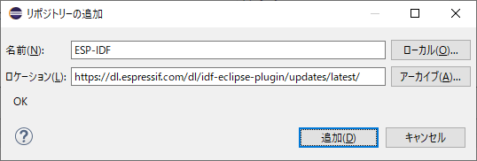
1. "Espressif IDF"が表示されるので､チェックボックスにチェックを入れて"次へ"をクリックする。
   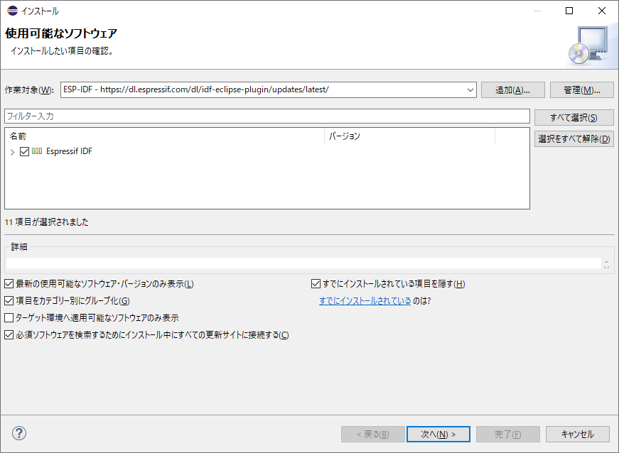
1. インストール詳細が表示されるので、"次へ"をクリックする。
   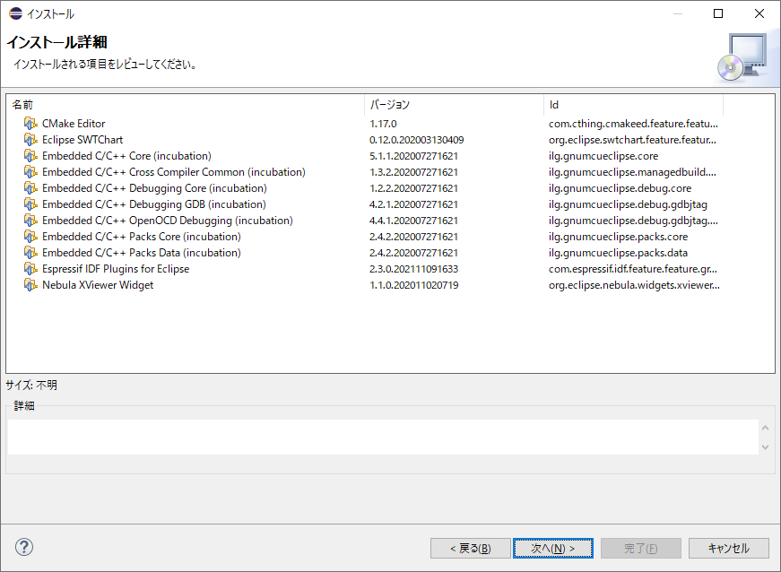
1. ライセンス同意画面になるので、"使用条件の条項に同意します"にチェックして"完了"をクリックする。
1. しばらくすると以下の画面が表示されるので、"インストール"をクリックする。
   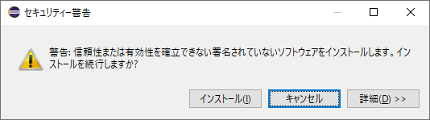
1. Eclipseの再起動をするか聞かれるので、"今すぐ再起動"をクリックする。
1. "Esoressif" -> "Download and Configure ESP-IDF"をクリックする。
   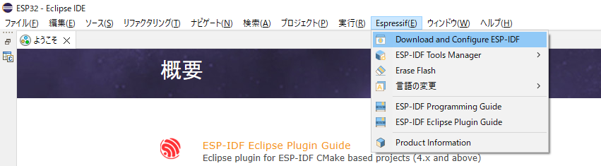
1. ESP-IDFのリポジトリとダウンロード先を選択後、"完了"をクリックする。  
   ダウンロード先は"ESP32"ディレクトリ
   
1. 以下のメッセージが出るまで待ち、出たら"はい"をクリックする。
   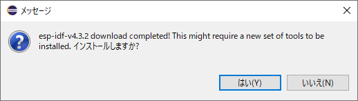
1. 以下のウィンドウが出るので、各々設定を行い、"Install Tools"をクリックする。
   * ESP-IDF Directory : 自動で入力される
   * Git Executable Location : git.exeを指定
   * Choose Python Version : インストールしたPythonのバージョンを指定
   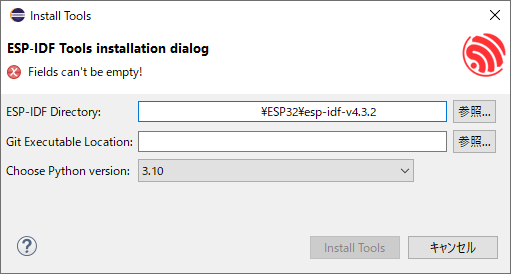

### 1.2 デバッガの構築
書き込みはシリアルコンソールから行えるが、デバッグはprintfデバッグしかできないので、JTAGでデバッグを行えるように設定を行う。
|              名称               | バージョン |       備考        |
| :------------------------------ | :--------- | :---------------- |
| [Zadig](https://zadig.akeo.ie/) | 2.7        |                   |
| FT232HL FT2232H              | -          | いずれか1つで良い |

#### 1.2.1 デバッガの設定
1. FT232HLまたはFT2232HをPCに接続する。
1. Zadigを起動する。
1. "Option" -> "List All Device"をクリックする。
   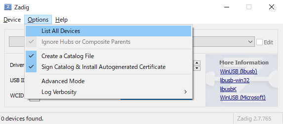
1. リストから、接続したデバイスを選択する。(今回は、"Single RS232-HS")
   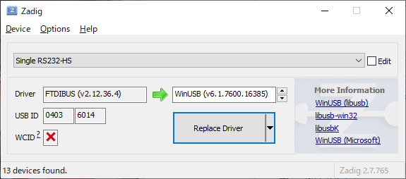
1. 赤枠で囲ったところを"WinUSB"にして、"Replace Driver"をクリックする。
   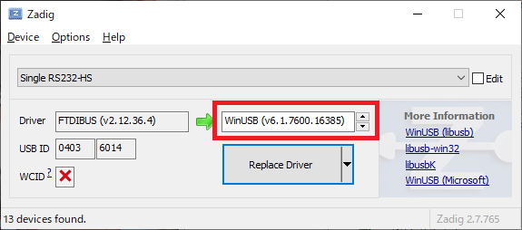
1. "close"をクリックする。
   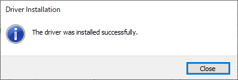
1. Zadigを終了する。

#### 1.2.2 ESP32とデバッガの接続
以下の表に合わせて、ESP32とデバッガを接続する。
| ESP32 ピン | JTAG ピン |
| :--------- | :-------- |
| IO12       | AD1       |
| IO13       | AD0       |
| IO14       | AD3       |
| IO15       | AD2       |
| GND        | GND       |

## 2 プロジェクトのビルド
ビルドができることを確認する。

### 2.1 プロジェクト作成
1. "ファイル" -> "新規" -> "プロジェクト"をクリックする。
   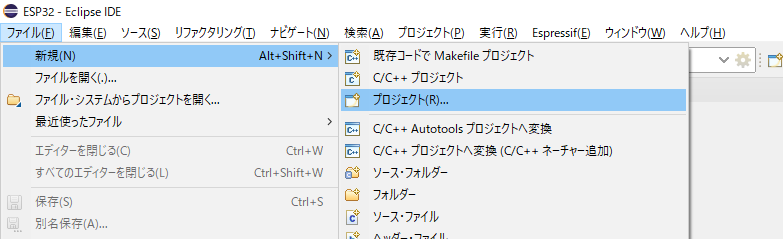
1. "EspressIf" -> "Espressif IDF Project"をクリックし、"完了"をクリックする。
   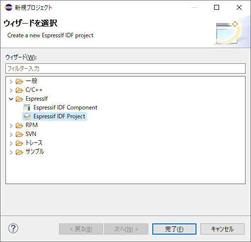
1. プロジェクト名に"test_build"と入力し、"次へ"をクリックする。  
   プロジェクト名は何でも良い。
   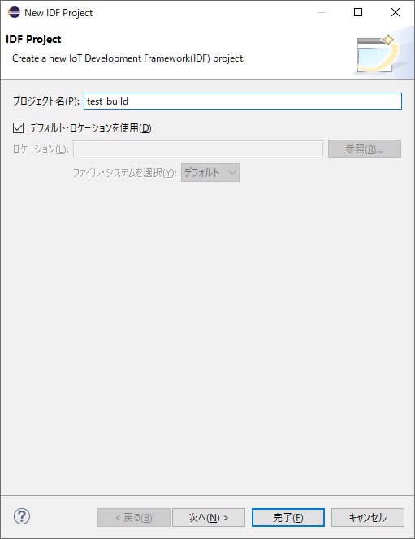
1. "Create a project using one of the templates"にチェックを入れ、"hello_world"を選択し、"完了"をクリックする。(プロジェクト名が"hello_world"になるので注意)
   新規で作る場合は、チェックを入れず、"完了"をクリックする。
   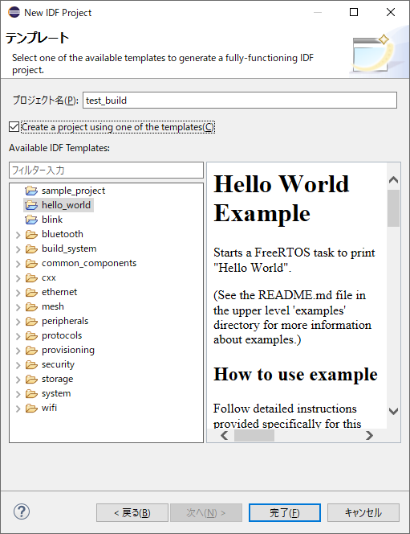

### 2.2 ビルド
1. 青枠で囲われているところを"esp32"にして、赤枠で囲われているボタンをクリックし、プロジェクトをビルドする。
   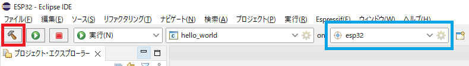
1. コンソールビューに以下の様に表示されればOK。
   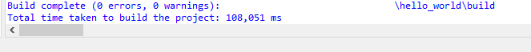

## 3 ファームウェアの書き込みとデバッグ
1. デバッグするプロジェクトを右クリックし、"デバッグ" -> "デバッグの構成"をクリックする。
   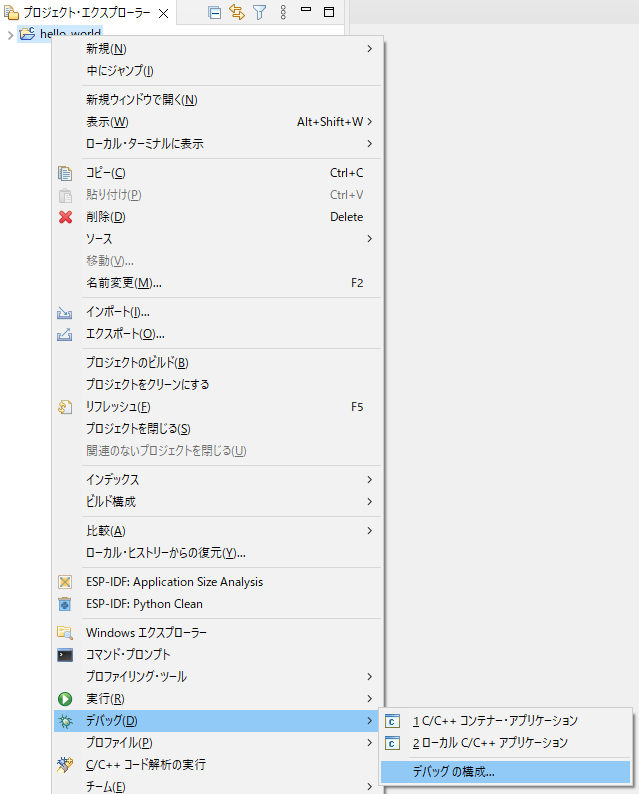
1. "ESP-IDF GDB OpenOCD Debugging"を右クリックし、"新規作成"をクリックする。
   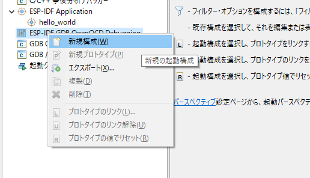
1. "デバッガー"タブをクリックして、以下のように設定を行い、"適用"をクリックする。
   * GDB port : 3333
   * Telnet port : 4444
   * Tcl port : 6666
   * Flash voltage : default
   * ターゲット : esp32
   * Board : ESP32 chip (via ESP-PROG)
   * Config options : `-s ${openocd_path}/share/openocd/scripts -f interface/ftdi/esp32_devkitj_v1.cfg -f target/esp32.cfg`
   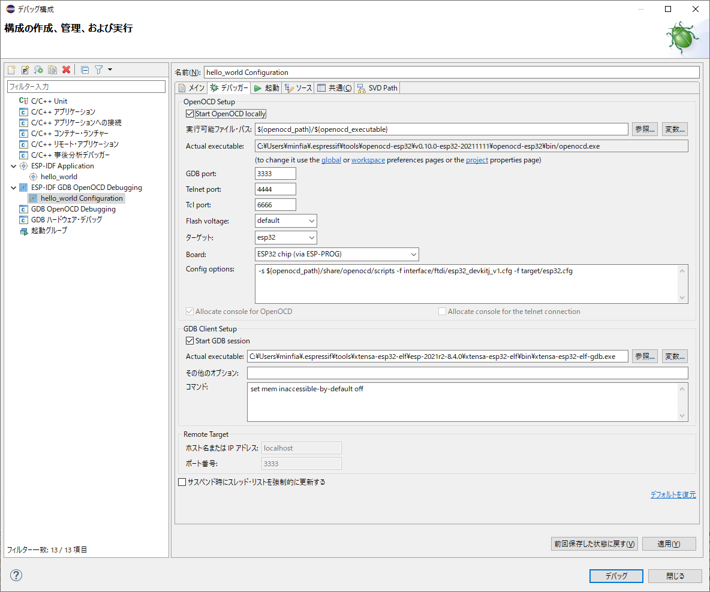
1. 以下のように、赤枠で囲まれているところを"デバッグ"にし、青枠で囲われているところを先ほど"新規作成"したものにし、緑枠で囲ったところを"esp32"にする。
   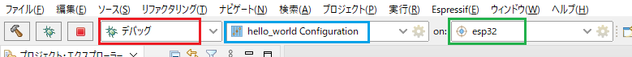
1. 赤枠で囲ったところをクリックする。
   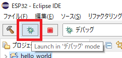
1. 以下のウィンドウが出たら、"常にこの設定を使用する"にチェックを入れ、"切り替え"をクリックする。
   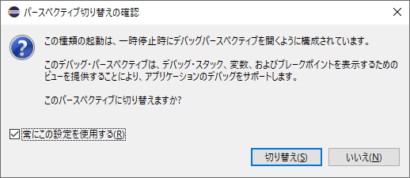
1. 以下の位置でブレークするので、あとは実行するなり自由にデバッグを行う。
   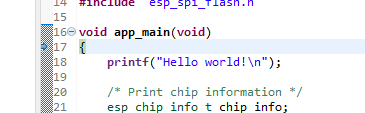

## シリアルコンソールの接続
ESP32は標準でシリアルコンソールへ出力する機能がある。  
ここでは、Eclipse上のシリアルコンソールで表示する方法を記載する。

### ピン接続
以下の表に合わせて、ESP32とUSB-UARTを接続する。  
Dev-Kitなどには、標準で付いているので、そちらを使用してもよい。  
| ESP32ピン | USB-UARTピン |
| :-------- | :----------- |
| Tx        | Rx           |
| Rx        | Tx           |
| GND       | GND          |

### シリアルコンソールへの表示
1. 赤枠で囲われた"ターミナル"をクリックする。
   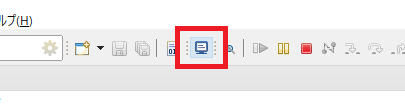
1. ターミナル設定ウィンドウが出るので、以下のように設定を行い、"OK"をクリックする。
   * ターミナルの選択 : ESP-IDF Serial Monitor
   * プロジェクト名 : 表示するプロジェクト名
   * Serial port : USB-UARTが接続されているCOM番号
   * エンコード : UARTの送受信で使用する文字コード
   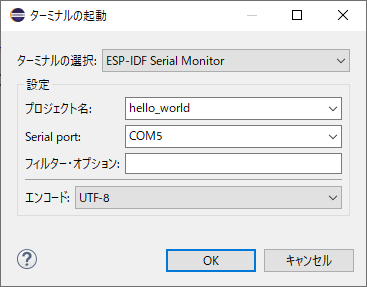
1. 以下のように、ターミナルタブが表示されるので、あとは自由に。
   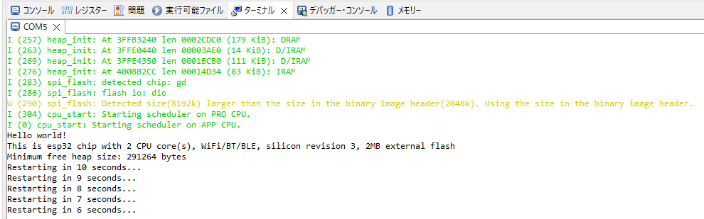