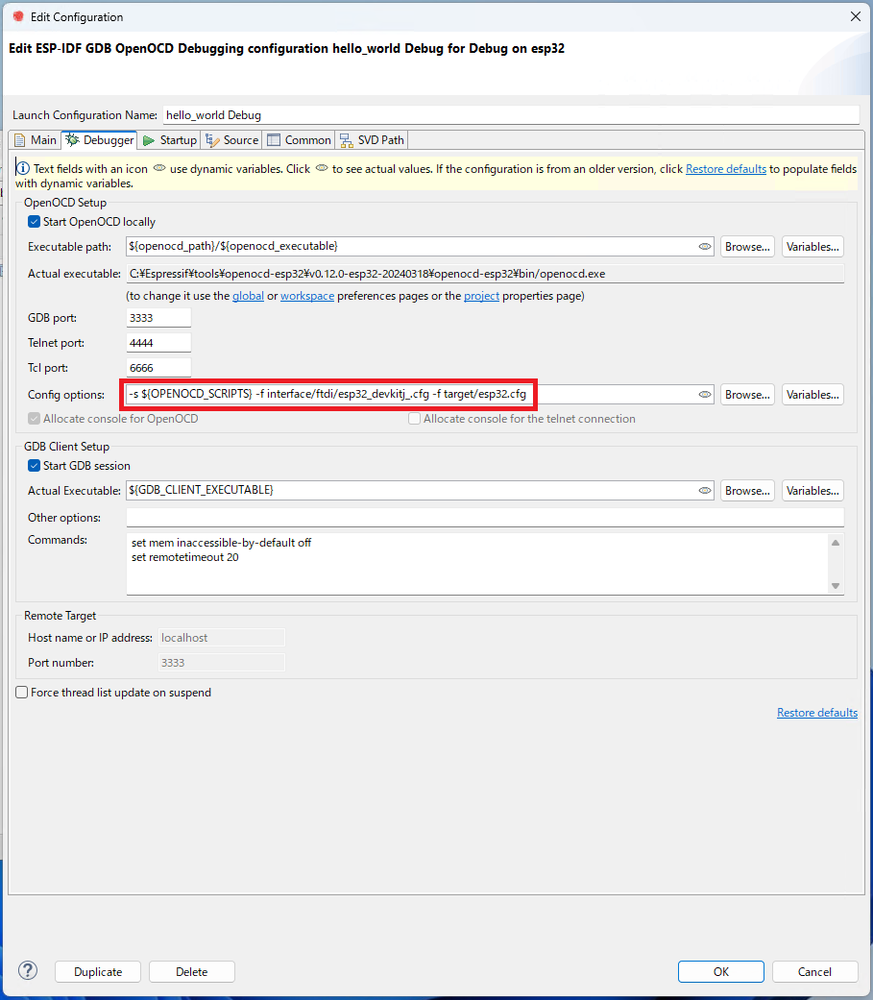

# ESP32の開発環境構築
Espressif-IDE(Eclipse)を使ったESP32の開発環境構築および、デバッグまでの手順を記載する。\
時期によって旧バージョンとなることがあるので、適宜読み替えること。

- [ESP32の開発環境構築](#esp32の開発環境構築)
  - [1 IDEの環境構築](#1-ideの環境構築)
  - [2 Espressif-IDEの初期設定](#2-espressif-ideの初期設定)
  - [3 デバッガの構築](#3-デバッガの構築)
    - [3.1 デバッガドライバのインストール](#31-デバッガドライバのインストール)
    - [3.2 ESP32とデバッガの接続](#32-esp32とデバッガの接続)
    - [3.3 デバッガドライバのアンインストール](#33-デバッガドライバのアンインストール)
  - [4 プロジェクトのビルド](#4-プロジェクトのビルド)
    - [4.1 プロジェクトの作成](#41-プロジェクトの作成)
    - [4.2 ビルド](#42-ビルド)
  - [5 プログラムのデバッグ](#5-プログラムのデバッグ)

## 1 IDEの環境構築
|                         名称                          |      バージョン       |              備考               |
| :---------------------------------------------------- | :-------------------- | :------------------------------ |
| [Espressif-IDE](https://dl.espressif.com/dl/esp-idf/) | v3.1.0(20241007-0706) | Eclipse + ESP-IDFの環境         |
| [Pleiades](https://willbrains.jp/#pleiades.html)      | -                     | Eclipse日本語化プラグイン(任意) |

1. Espressif-IDEのインストーラーをダウンロードする\
   \
   赤枠はオンラインインストーラー\
   紫枠はオフラインインストーラー\
   緑枠はESP-IDF単体のオフラインインストーラー\
   赤枠で囲った箇所で説明する
1. ダウンロードしたファイルを実行する
1. "English"を選択する\
   
1. ライセンスに同意する\
   
1. システムチェックが完了するまで待つ\
   \
   途中、250文字以上のパスを使えるようにレジストリを書き換える箇所があるので、出てきた場合は同意する
1. ESP-IDFの選択を行う\
   \
   初めてESP-IDFをインストールする場合は、"Download ESP-IDF"を選択する\
   すでにESP-IDFがインストールされている場合は、"Use an existing ESP-IDF directory"を選択する\
   今回は初めてなので"Download ESP-IDF"を選択
1. インストールするESP-IDFのバージョンを選択する\
   \
   ".zip archive download"でインストールを行うとデバッグで問題が発生するので注意\
   "git clone"でインストールを行うと問題なくデバッグできたのでこちらを選択する\
   今回は"release/v5.3 (release branch - git clone)"をインストールする\
   インストール先を変えたい場合は、"Choose a directory to install ESP-IDF to"から変更する
1. Espressif-IDEを含むESP-IDF toolのイントールパスを設定する\
   
1. インストールするコンポーネントを選択する\
   \
   画像のように設定する\
   "Chip Targets"は自身が使うものを選択する
1. インストール内容の確認\
   
1. インストールを開始すると以下のようになるので完了まで待つ\
   \
   途中、以下のようなのが出た場合はインストールを行う\
   
1. 完了すると以下のような表示になるので、そのまま"Finish"を押下する\
   
1. PowerShellが起動し、以下のようなプロンプトが流れる\
   \
   以下のようになったら完了となり、PowerShellを終了してよい\
   \
   コマンドプロンプトでも同様
1. デスクトップに以下のアイコンが作成される\
   

## 2 Espressif-IDEの初期設定
1. "Espressif-IDE"のショートカットから"Espressif-IDE"を起動する
1. プロジェクトの保存先を選択する\
   \
   "Use this as the default and do not ask again"にチェックをいれると、以降起動時に聞かれなくなる
1. "Launch"で実行すると以下のように"Espressif-IDE"が起動する
   
1. 左下に"Installing tools...:(xx%)"と出ている間は待つ\
   "Welcome"タブを閉じると以下のようなものが表示される\
   
1. 完了すると以下のようになる\
   
1. "Window"→"Preferences"をクリックする\
   
1. "Preferences"ウィンドウが開いたら"Install/Update"→"Automatic Updates"をクリックする\
   自動アップデートによる開発環境の破壊を防ぐため、"Automatically find new updates and notify me"のチェックを外す\
   
1. 以降は好みで設定を変える(外見や文字コード、改行コードなど)
1. 変更が完了したら"Apply and Close"で変更内容を適用する

## 3 デバッガの構築
書き込みはシリアルコンソールから行えるが、デバッグはprintfデバッグしかできないためJTAGでデバッグを行えるように設定を行う。
|              名称               | バージョン |       備考        |
| :------------------------------ | :--------- | :---------------- |
| [Zadig](https://zadig.akeo.ie/) | 2.9        |                   |
| FT232HL FT2232H FT2232D   | -          | いずれか1つで良い |

### 3.1 デバッガドライバのインストール
1. FT232HL、FT2232HまたはFT2232DをPCに接続する\
   FT232HL：1chのUSBシリアル変換を持つ(JTAGとして使用)\
   FT2232H：2chのUSBシリアル変換を持つ(JTAGとUARTとして使用)\
   FT2232D：2chのUSBシリアル変換を持つ(JTAGとUARTとして使用)
1. PCに接続するとデバイスマネージャーからは以下のように表示される\
   "FT232HL"の場合\
   \
   "FT2232D"の場合("FT2232H"も？)\
   
1. Zadigを起動する
1. "Option"→"List All Device"をクリックしてチェックを入れる\
   
1. リストから接続したデバイスを選択する\
   "FT232HL"の場合は以下のようになる\
   \
   "FT2232D"の場合は以下のようになる("FT2232H"も？)\
   2ch入りでは、"Dual RS232 (Interface 0)"と"Dual RS232 (Interface 1)"が出るが、"Dual RS232 (Interface 0)"を選択すること\
   
1. 以下のように赤枠で囲ったところを"WinUSB"にして"Replace Driver"をクリックする\
   "FT232HL"の場合\
   \
   "FT2232D"の場合("FT2232H"も？)\
   
1. 完了すると以下の表示が出るので"Close"をクリックする\
   
1. Zadigを終了する
1. デバイスマネージャーからは以下のように表示される\
   "FT232HL"の場合\
   \
   "FT2232D"の場合("FT2232H"も？)\
   

### 3.2 ESP32とデバッガの接続
以下の表に合わせて、ESP32とデバッガを接続する。
| ESP32 | FT232HL | FT2232D[^1] |  信号名  |
| :---: | :-----: | :---------: | :------: |
| IO12  | ADBUS1  |   ADBUS1    |   TDI    |
| IO13  | ADBUS0  |   ADBUS0    |   TCK    |
| IO14  | ADBUS3  |   ADBUS3    |   TMS    |
| IO15  | ADBUS2  |   ADBUS2    |   TDO    |
|  EN   | ACBUS0  |   ACBUS0    |   RST    |
|  TX   |  -[^2]  |   BDBUS1    | UART(TX) |
|  RX   |  -[^2]  |   BDBUS0    | UART(RX) |
|  GND  |   GND   |     GND     |          |

[^1]: AE-2232を使用する場合、VCCIOA/VCCIOBのジャンパを外し、別途3.3V電源を用意して供給する必要がある
[^2]: FT232HLでは別途、USB-UART変換器が必要(使用しない場合は不要)

### 3.3 デバッガドライバのアンインストール
デバッガ部分を元のCOMポートに戻したい場合は、以下の手順でアンインストールができる。
1. FT232HL、FT2232HまたはFT2232DをPCに接続する
1. デバイスマネージャーを起動する
1. "ユニバーサル シリアル バス デバイス"のリストを右クリックし、アンインストールをする\
   "FT232HL"の場合\
   \
   "FT2232D"の場合("FT2232H"も？)\
   
1. PCから一度切断し、再接続することでCOMポートとして認識される

## 4 プロジェクトのビルド
ビルドができることを確認する。

### 4.1 プロジェクトの作成
1. "File"→"New"→"Espressif IDF Project"をクリックする\
   
1. "New Project"ウィンドウが出るので以下のようにする(今回はサンプルプロジェクトを実行する)
   \
   "Select Project Target"は"esp32"を選択\
   "Create a project using one of the template"にチェックを入れ、"hello_world"を選択\
   新規で作る場合は、チェックを入れず、"Finish"をクリックする。  
1. プロジェクトが作成されると"Project Explorer"に追加される\
   

### 4.2 ビルド
1. 青枠で囲われているところを"esp32"にして、赤枠で囲われているボタンをクリックしプロジェクトをビルドする\
   
1. コンソールビューに以下の様に表示されればOK\
   

## 5 プログラムのデバッグ
1. デバッガとESP32を接続する
1. 以下のように、緑枠で囲われている箇所を"Debug"、青枠で囲われている箇所を"hello_world Debug"にする\
   

   

   
Espressif-IDE v3.0.0以前

   以下のように、緑枠で囲われている箇所を"Debug"、青枠で囲われている箇所を"hello_world Configuration"にする\
   
   

1. "hello_world Configuration"の横にある歯車をクリックする
1. "Edit Configuration"ウィンドウが開くので、"Debugger"タブをクリックし、以下のように設定する\
   \
   "Config options"を`-s ${OPENOCD_SCRIPTS} -f interface/ftdi/esp32_devkitj_v1.cfg -f target/esp32.cfg`に変更する

   

   
Espressif-IDE v3.0.0以前

   \
   "Board"を"ESP32 chip (via ESP-PROG)"に変更する
   

1. 変更したら"OK"を押下し閉じる
1. 赤枠で囲った箇所をクリックし、デバッグを開始する\
   
1. 以下のウィンドウが出たら、"Remember my decision"にチェックを入れ、"Switch"をクリックする\
   
1. 以下のように"app_main"でブレークする\
   
1. 赤枠で囲った箇所をクリックすることで"Terminal"表示が可能となる\
   
1. クリックすると以下のように設定ウィンドウが出るので設定し"OK"をクリックする\
   \
   "Choose terminal"は"ESP-IDF Serial Monitor"\
   "Project name"は該当のプロジェクト(今回は"hello_world")\
   "Serial port"はUSB-UARTが接続されているCOMポート\
   "Encoding"は使用する文字コード
1. 以下のように"Terminal"タブが表示される\
   
1. 赤枠で囲った箇所をクリックするとプログラムの実行をする\
   
1. 以下のように、"Terminal"タブから文字列が出力される
   

以上。
