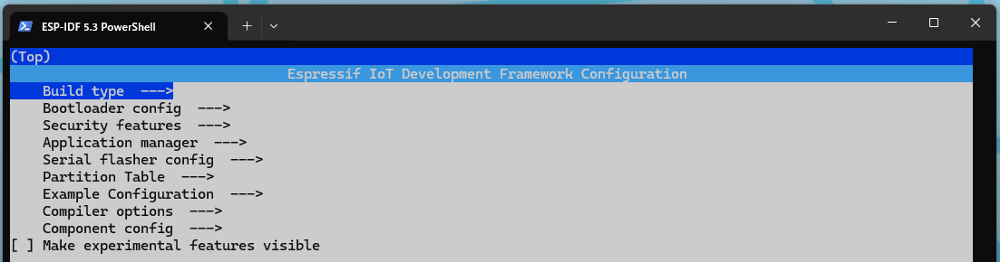
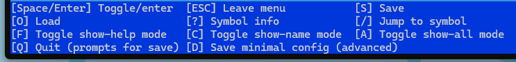

# ESP-IDF Configuration
`idf.py menuconfig`から設定できる"sdkconfig"ついて記載する。\
内容は都度更新する。\
ベースはESP-IDF v5.3。\
\
主に以下のキーで操作を行う。\
方向キーで各項目の移動が可能。\

- [ESP-IDF Configuration](#esp-idf-configuration)
  - [1 Build type](#1-build-type)
  - [2 Bootloader config](#2-bootloader-config)
  - [3 Security features](#3-security-features)
  - [4 Application manager](#4-application-manager)
  - [5 Serial flasher config](#5-serial-flasher-config)
  - [6 Partition Table](#6-partition-table)
  - [7 Example Configuration](#7-example-configuration)
  - [8 Compiler options](#8-compiler-options)
  - [9 Component config](#9-component-config)
  - [10 Make experimental features visible](#10-make-experimental-features-visible)

## 1 Build type
[Build type](./sdkconfig-build-type.md)を参照

## 2 Bootloader config
[Bootloader config](./sdkconfig-bootloader-config.md)を参照

## 3 Security features
[Security features](./sdkconfig-security-features.md)を参照

## 4 Application manager
[Application manager](./sdkconfig-application-manager.md)を参照

## 5 Serial flasher config
[Serial flasher config](./sdkconfig-serial-flasher-config.md)を参照

## 6 Partition Table
[Partition Table](./sdkconfig-partition-table.md)を参照

## 7 Example Configuration
[Example Configuration](./sdkconfig-example-configuration.md)を参照

## 8 Compiler options
[Compiler options](./sdkconfig-compiler-options.md)を参照

## 9 Component config
[Component config](./sdkconfig-component.md)を参照

## 10 Make experimental features visible
[Make experimental features visible](./sdkconfig-make-experimental-features-visible.md)を参照
