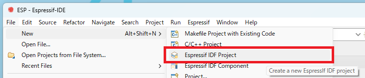
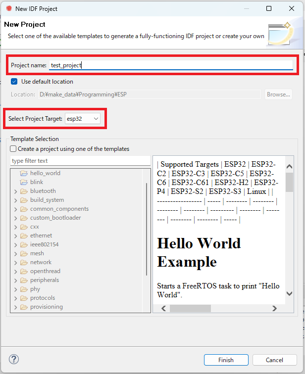
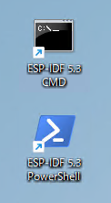
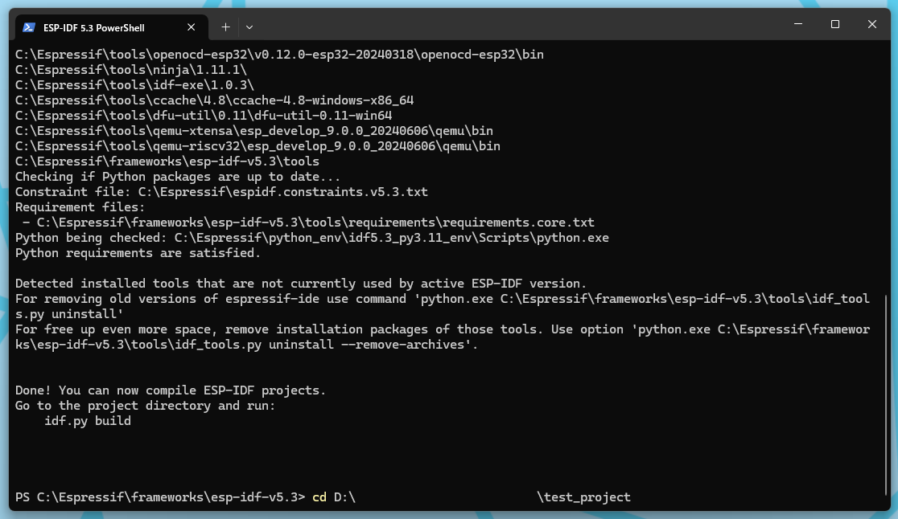
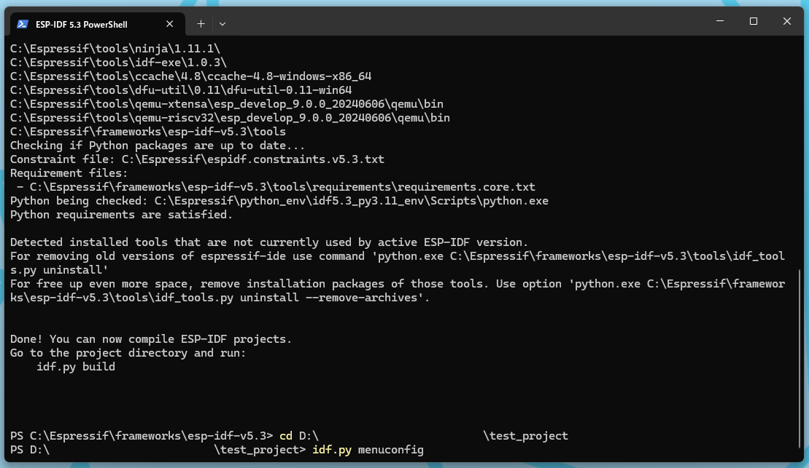
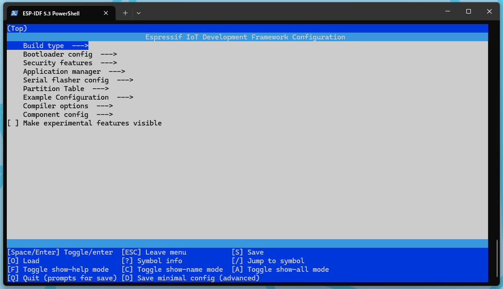
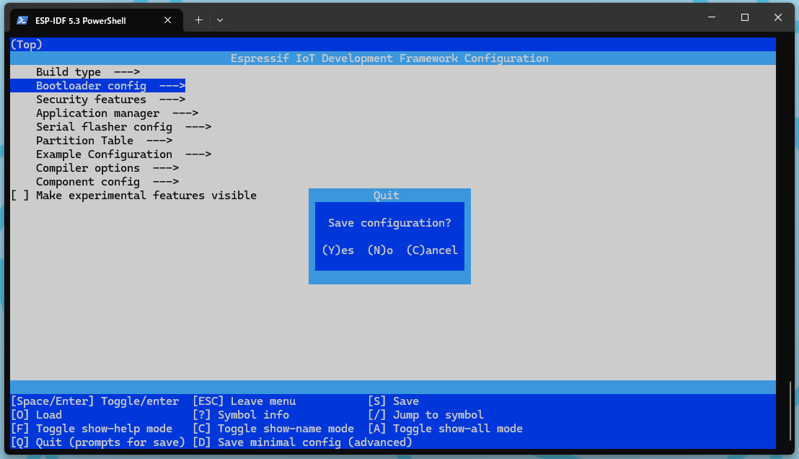
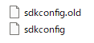
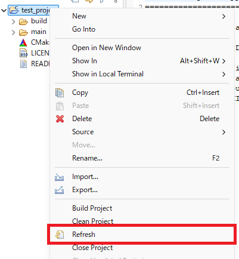

# 新規プロジェクトの作成
Espressif-IDE(Eclipse)を使ったESP32の新規プロジェクト(ブランクプロジェクト)作成に関して記載する。

- [新規プロジェクトの作成](#新規プロジェクトの作成)
  - [1. プロジェクト作成](#1-プロジェクト作成)

## 1. プロジェクト作成
1. "File"→"New"→"Espressif IDF Project"をクリックする\

1. "New Project"ウィンドウが出るので以下のようにする\
\
ProjectName: 任意の名前を入力する。\
"Select Project Target"を使用するESP32に設定する。\
設定したら"Finish"をクリックする。
1. 以下のいずれかを起動する(ショートカット名の"5.3"はインストールしたESP-IDFのバージョンに依存)\
\
ここでは"ESP-IDF 5.3 PowerShell"を起動する。
1. さっき作ったプロジェクトのディレクトリに移動する\

1. 以下のコマンドを実行し、"sdkconfig"を作成する\
`idf.py menuconfig`\
他にはプロジェクトをビルドすることで作成もできる\
各設定項目については[ESP-IDF Configuration](../docs/sdkconfig-top.md)を参照

1. 以下のようになるので設定を行う\

1. 設定が終わったら、"Q"キーを押下すると以下の画面になる\
\
"Y"キーで現在の設定を保存して終了\
"N"キーで保存せず終了\
"C"キーで終了しない
1. 以下のファイルが作成される\
\
"sdkconfig.old"は前回の"sdkconfig"のファイル(config menuを開いた時点で作成される模様)\
"sdkconfig"は先ほど保存した設定ファイル
1. IDEに戻り"Project Explorer"を確認すると、先ほど作成した"sdkconfig"が表示されていないので、以下の画像のように"Project Explorer"上で右クリックし"refresh"を押下する\

